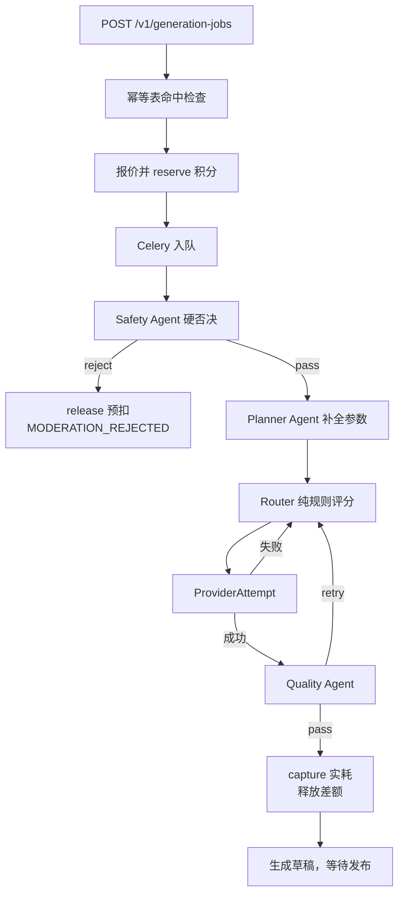

# 架构说明

## 分层

```text
back/app/
├─ api/            HTTP 边界：路由、鉴权依赖、幂等、限流、错误映射
│  ├─ v1/          /v1 公开契约
│  └─ v1/admin/    /v1/admin 独立命名空间，独立会话与限流
├─ domain/         领域服务：唯一允许写业务状态的地方
│  ├─ credits/     预扣、结算、释放、回流分成
│  ├─ jobs/        任务状态机、报价、事件流
│  ├─ licensing/   许可快照与二创权限
│  ├─ lineage/     创作链边与墓碑
│  ├─ media/       上传、指纹、溯源清单
│  ├─ publishing/  发布事务、可见性、墓碑
│  ├─ search/      向量与关键词混合检索
│  ├─ audit/       追加式审计
│  └─ compliance/  数据导出与匿名化
├─ agents/         Safety / Planner / Quality / Copy / Router
├─ teams/          Generation Gateway Team
├─ workflows/      生成工作流编排
├─ providers/      生成供应商适配器（fake open / fake paid）
├─ llm/            OpenAI 兼容网关客户端、模式切换、响应规范化
├─ platform_config/ 运行时配置中心与 Feature Flag
├─ workers/        Celery 任务与五个队列
├─ models/         SQLAlchemy 模型
├─ security/       密码、JWT、权限
└─ observability/  日志与 OpenTelemetry
```

一条铁律：**API 层不写业务状态，Agent 层不写数据库。** API 校验入参与权限后调用领域服务；Agent 只能通过白名单工具读数据、给建议，写库一律由领域服务完成。这样「智能体幻觉」最坏的后果是一个糟糕的建议，而不是一条错误的账本记录。

## Agno 集成方式

产品的 FastAPI 实例作为 `base_app` 交给 `AgentOS`，而不是反过来。顺序很重要：`/v1` 是对外承诺的稳定契约，智能体是挂在它旁边的能力，不能让契约随智能体框架的版本变化而漂移。

工具白名单在 `app/agents/tools.py`。加一个工具前先问：这个工具会不会让智能体绕过领域不变量？如果会，它就不该是工具，而该是领域服务里的一个方法。

## 生成任务全流程



关键取舍：

- **状态机用条件 UPDATE 迁移。** `created→queued→submitted→running→{succeeded|failed|cancelled|expired}`，每次迁移带 `WHERE status IN (...)`，终态不可回退。乱序回调因此天然安全：迟到的「running」打不进已经 `succeeded` 的任务。
- **`JobEvent.sequence` 单调递增。** SSE 断线重连时按 `Last-Event-ID` 从数据库补发历史事件，再接 Redis pubsub 收实时事件。客户端不需要自己去重。
- **Router 不接 LLM。** 路由必须可解释、可回放、可复现，因此是纯规则评分。后台的「决策逐候选回放」能把每个候选为什么被过滤、得了多少分完整列出来，这是黑盒模型做不到的。

## 积分不变量

`04` 第 2.6/6 节的三条不变量，实现方式：

| 不变量 | 怎么保证 |
| --- | --- |
| 余额不能为负 | `CreditAccount` 带乐观锁 `version`，扣减用带条件的 UPDATE |
| 一个任务最多 capture 一次 | `(account_id, type, job_id)` 唯一索引 |
| reserve 之后必然 capture 或 release | 后台「悬挂预扣」报表直接查这个缺口；非空即代表某条结算路径漏了 |

账本是追加式的。后台人工调账只能追加一条 `adjustment`，不能改历史记录，并且强制填写理由写入 `AuditLog`。

## 路由评分

按 `03` 6.2/6.3 的固定顺序执行：硬性过滤 → 逐候选打分 → 取最高分。`effective_cost` 包含失败重试的放大系数；统计样本不足时用保守先验，避免一个刚上线的供应商因为「零失败率」直接吃掉全部流量。四个权重（质量 / 延迟 / 成本 / 可靠性）读自配置中心，后台可热更新，每次变更写审计并可回滚。

## LLM 网关响应规范化

三个模型的输出形态完全不同，`app/llm/` 统一处理：

- `ling-3.0-flash-free` 是 reasoning 模型，推理 token 计入 `max_tokens`。给它按普通模型估算预算，会拿到空 `content` 加 `finish_reason=length`。
- 思考模型即使指定 `response_format={"type":"json_object"}`，仍可能在 JSON 前吐 `<think>...</think>`。
- `doubao-seed-2-1-pro` 输出干净 JSON，所以安全判定绑给它。

规范化层做四件事：剥离思考块与 `reasoning_details`、从自由文本里定位并提取 JSON、解析失败先修复重试再降级、把模型 / token 用量 / 延迟 / 是否降级写进 `AgentRun`。

## 前端结构

```text
front/src/app/[locale]/
├─ (site)/    C 端 12 个页面，沉浸式外壳
└─ (admin)/   后台控制台，独立 layout、独立登录、独立 API client
```

两套外壳共用同一组设计令牌与三态主题，但会话、API 命名空间、限流与权限体系完全隔离。共用设计令牌是为了视觉一致；隔离会话是为了一个被盗的 C 端 token 不能碰后台。

主题是双层令牌：`02` 第 3 节的深色色值原样作为深色基准，浅色是同名语义令牌的另一组取值。组件只消费语义令牌，永远不写死颜色，因此深色主题不会因为加浅色而漂移。
